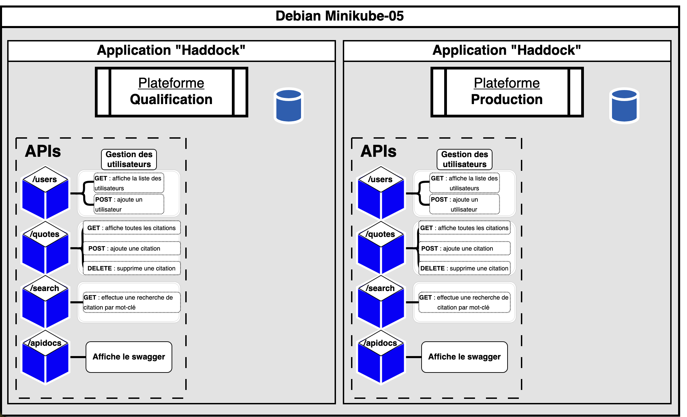

# Saé503 - Orchestrer la conteneurisation d’une application 
Elaboré par **Loris Egault** & **Simon Rageul** ***(Binôme 5)***
#### Promotion BUT3 FA *2024-2025*
---
# Lot 1 : Dossier d'Architecture Technique (DAT)

### 1. Introduction

Ce document décrit l'architecture technique à mettre en place pour déployer une application web permettant d'afficher et de gérer des citations du capitaine Haddock. Cette architecture vise à garantir la flexibilité, la portabilité grâce à une approche basée sur la conteneurisation et l'orchestration.

### 2. Description de l'architecture

2.1 Objectifs

- Disposer de plusieurs plateformes (qualification, production) cloisonnées.
- Permettre une montée en charge à travers un orchestrateur de conteneurs.
- Assurer la persistance des données et leur sécurité.
- Garantir une supervision  pour suivre les performances et gérer les incidents.

2.2 Vue d’ensemble de l’architecture

L’application sera conteneurisée à l’aide de Docker et déployée avec un orchestrateur Kubernetes (Minikube) sur deux plateformes :
- Qualification : Destinée aux tests et vérifications.
- Production : Destinée à la mise en ligne pour les utilisateurs finaux.

Chaque plateforme comprendra plusieurs services (users, quotes, search, apidocs) déployés comme des microservices dans des conteneurs indépendants. Un reverse proxy gérera l’acheminement des requêtes.

### 3. Composants Techniques

3.1 Conteneurisation
- Docker : Les microservices seront encapsulés dans des images Docker.
- Registry : Un registre privé (DockerHub) stockera les images.

3.2 Orchestrateur
Kubernetes :
- Isoler les ressources entre les plateformes.
- Orchestration et gestion des pods...
- Gestion du stockage des données.

3.3 Reverse Proxy
Traefik :
- Gestion des accès httpvers les microservices.
- Configuration du limiteur de requêtes à 10 requêtes/minute.

3.4 Base de Données
- Stockage persistant des données
- Volumes persistants configurés via Kubernetes (PersistentVolume et PersistentVolumeClaim).

3.5 Observabilité
- Prometheus : Collecte des métriques (CPU, mémoire, état des conteneurs, temps de réponse de la base de données).
- Grafana : Tableau de bord interactif pour visualiser les métriques.
- Alertmanager : Envoi d’alertes par mail ou messagerie instantanée en cas d’événements critiques.

3.6 Gestion des Noms de Domaine
- nip.io : Attribution de FQDN dynamiques pour chaque plateforme.
Exemple : qualification.<ip>.nip.io, production.<ip>.nip.io.

### 4. Diagrammes

Schéma global de l'architecture : 

### 5. Justifications des Choix Techniques

- Kubernetes : 
  - Standard industriel pour l’orchestration des conteneurs. 
  - Gestion native des namespaces pour cloisonner les plateformes.

- Traefik :
  - Intégration facile avec Kubernetes.
  - Support des limites de requêtes et gestion du routage.

- Grafana :
  - Permet une bonne supervision et des tableaux de bord interactifs.

- nip.io :
  - Solution simple et économique pour gérer les FQDN.

- Données dans des csv :
  - Facilité de mise en oeuvre.

### 6. Conclusion

Cette architecture garantit une gestion efficace des ressources et une flexibilité adaptée aux besoins de l’application. Les choix technologiques respectent les contraintes du projet tout en assurant la performance et la sécurité des données.

